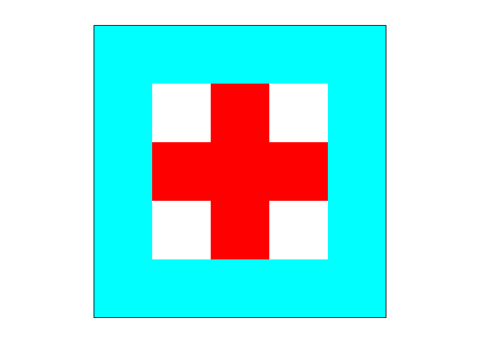

Installation
------------

``` r
# install.packages("remotes")
remotes::install_github("hsonne/findblobs")
```

Plot an Integer Matrix
----------------------

``` r
findblobs::plot_integer_matrix(matrix(nrow = 5, byrow = TRUE, c(
  2, 2, 2, 2, 2,
  2, 0, 1, 0, 2,
  2, 1, 1, 1, 2,
  2, 0, 1, 0, 2,
  2, 2, 2, 2, 2
)))
```



Create Random Blobs
-------------------

``` r
random_blobs <- findblobs::place_random_blobs(
  n_blobs = 5, min_fields = 3, max_fields = 10
)
```


Find Blobs
----------

``` r
# Provide matrix of logical
M <- random_blobs > 0

# Find the blobs
found_blobs <- findblobs:::get_blobs(M)
```

    ## Getting column blobs ... ok. (0.00s) 
    ## Getting row blobs ... ok. (0.04s) 
    ## Merging group info with method 4 ... ok. (0.01s) 
    ## Merging group info with method 5 ... ok. (0.00s)

``` r
# Plot the blobs. Compare with random_blobs above
findblobs::plot_integer_matrix(found_blobs)
```


