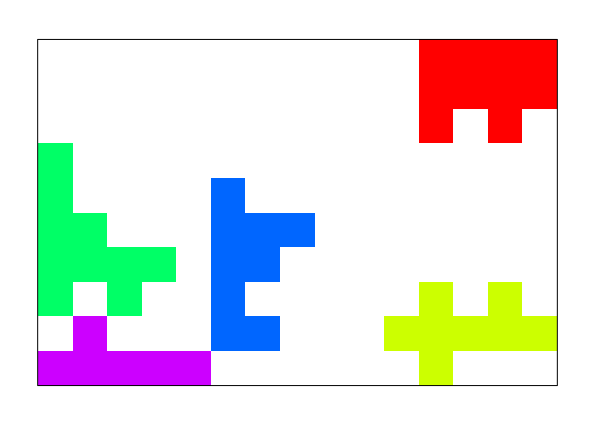

Installation
------------

``` r
# install.packages("remotes")
remotes::install_github("hsonne/findblobs")
```

Plot an Integer Matrix
----------------------

``` r
findblobs::plot_integer_matrix(matrix(nrow = 5, byrow = TRUE, c(
  2, 2, 2, 2, 2,
  2, 0, 1, 0, 2,
  2, 1, 1, 1, 2,
  2, 0, 1, 0, 2,
  2, 2, 2, 2, 2
)))
```


Create Random Blobs
-------------------

``` r
blob_matrix <- findblobs::place_random_blobs(
  n_blobs = 5, min_fields = 3, max_fields = 10
)
```

    ## Creating blob 1/5 with 10 fields

    ## Creating blob 2/5 with 8 fields

    ## Creating blob 3/5 with 10 fields

    ## Creating blob 4/5 with 9 fields

    ## Creating blob 5/5 with 6 fields


